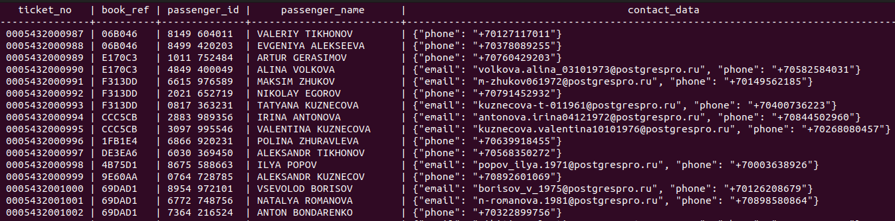

# Index

### 1 вариант  
#### a) создать индекс на таблицу  

Создадим индекс на таблицу bookings.airports:  
CREATE INDEX CONCURRENTLY airport_city_idx ON bookings.airports(city);  

#### b) Анализируем EXPLAIN 
Выполним запрос 
EXPLAIN ANALYZE  
SELECT * FROM bookings.airports where city = 'Липецк'; 

Видим что поиск осуществляется по последовательному чтению:
                                              
--------------------------------------------------------------------------------------------------- 
Seq Scan on airports  (cost=0.00..3.30 rows=1 width=69) (actual time=0.033..0.036 rows=1 loops=1)  
  Filter: (city = &apos;Липецк&apos;::text)  
    Rows Removed by Filter: 103  
Planning Time: 0.098 ms  
Execution Time: 0.054 ms  

Скорее всего дело в том что планироващик считает это оптимальным планом запроса. Отключим использование последовательного сканирования:  
set enable_seqscan = 'off';  

----------------------------------------------------------------------------------------------------------------------------  
 Index Scan using airport_city_idx on airports  (cost=0.14..8.16 rows=1 width=69) (actual time=0.027..0.029 rows=1 loops=1)  
   Index Cond: (city = 'Липецк'::text)  
Planning Time: 0.102 ms  
Execution Time: 0.051 ms  

Видим что да, по планировщику стоимость чтения по индексу выше 8.16 > 3.30. Но реальное выполние показывает обратную картину - 0.029 против 0.036seq_scan)

Один из моментов - был настроен effective_cache_size 4GB в то время как у нас RAM 2GB. Выставим 1,5 а так же уменьшим random_page_cost (по умолчанию 4, а seq_page_cost 1).

Теперь у нас у нас идет сканирование по индексу airport_city_idx.

#### в) Создать индекс на несколько полей.
Это можно осуществить путем перечисления полей в таблице)  
CREATE INDEX boarding_passes_flight_id_boarding_no_key ON bookings.boarding_passes(flight_id, boarding_no);  

#### г) Реализовать индекс на часть таблицы или индекс на поле с функцией.

Для примера создадим индекс только для аэропорта отправления Домодедово (DME);
CREATE INDEX departure_airport_dme_idx ON bookings.flights(departure_airport) WHERE departure_airport = 'DME';

#### д) Индекс для полнотекстового поиска
Возьмем таблицу tickets

Выполним запрос без индекса 
select * from tickets where passenger_name ilike 'lu%';

                                 QUERY PLAN                                 
----------------------------------------------------------------------------
Gather  (cost=1000.00..9057.37 rows=33 width=104)
  Workers Planned: 2
  ->  Parallel Seq Scan on tickets  (cost=0.00..8054.07 rows=14 width=104)
Filter: (passenger_name ~* 'lu%'::text)

select passenger_name, to_tsvector(passenger_name) from tickets;

Выполним запрос по лексеме (так же без индекса) 
explain select passenger_name, to_tsvector(passenger_name) @@ to_tsquery('popov') from tickets;

                                QUERY PLAN                                    

---------------------------------------------------------------------------------
Gather  (cost=1000.00..122129.87 rows=366733 width=17)
   Workers Planned: 2
    ->  Parallel Seq Scan on tickets  (cost=0.00..84456.57 rows=152805 width=17)
JIT:
  Functions: 2
  Options: Inlining false, Optimization false, Expressions true, Deforming true

Добавим поле passenger_name_lex по которому будет составлен текстовый поиск  
ALTER TABLE tickets ADD COLUMN passenger_name_lex tsvector;
update tickets set passenger_name_lex = to_tsvector(passenger_name);  

Индекс:
CREATE INDEX search_passenger_name ON tickets USING GIN (passenger_name_lex);

Разница заметна:
* без индекса
explain select passenger_name from tickets where passenger_name_lex @@ to_tsquery('popov');

                                  QUERY PLAN                                  
------------------------------------------------------------------------------
Gather  (cost=1000.00..55519.12 rows=4547 width=16)
 Workers Planned: 2
 ->  Parallel Seq Scan on tickets  (cost=0.00..54064.42 rows=1895 width=16)
Filter: (passenger_name_lex @@ to_tsquery('popov'::text))

* с индексом
                                QUERY PLAN                                       
----------------------------------------------------------------------------------------
Bitmap Heap Scan on tickets  (cost=41.49..6065.17 rows=4547 width=16)
 Recheck Cond: (passenger_name_lex @@ to_tsquery('popov'::text))
 ->  Bitmap Index Scan on search_passenger_name  (cost=0.00..40.36 rows=4547 width=0)
Index Cond: (passenger_name_lex @@ to_tsquery('popov'::text))

