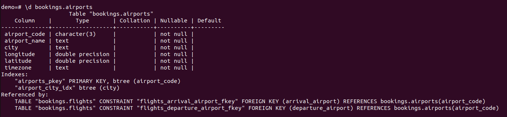

# Index

### 1 вариант  
*Создадим индекс на таблицу bookings.airports:  
CREATE INDEX CONCURRENTLY airport_city_idx ON bookings.airports(city);  

* Выполним запрос 
EXPLAIN ANALYZE  
SELECT * FROM bookings.airports where city = 'Липецк';

Видим что поиск осуществялется по последовательному чтению  
QUERY PLAN                                               
--------------------------------------------------------------------------------------------------- 
Seq Scan on airports  (cost=0.00..3.30 rows=1 width=69) (actual time=0.033..0.036 rows=1 loops=1)  
  Filter: (city = &apos;Липецк&apos;::text)  
    Rows Removed by Filter: 103  
Planning Time: 0.098 ms  
Execution Time: 0.054 ms  

Скорее всего дело в том что планироващик считает это оптимальным планом запроса. Отключим использвание последовательного сканирования:  
set enable_seqscan = 'off';  

QUERY PLAN                                                           
----------------------------------------------------------------------------------------------------------------------------  
 Index Scan using airport_city_idx on airports  (cost=0.14..8.16 rows=1 width=69) (actual time=0.027..0.029 rows=1 loops=1)  
   Index Cond: (city = 'Липецк'::text)  
Planning Time: 0.102 ms  
Execution Time: 0.051 ms  

Видим что да, по планировщику стоимость чтения по индексу выше 8.16 > 3.30. Но реальное выполние показывает обратную картину - 0.029 против 0.036seq_scan)

Один из моментов - был настроен effective_cache_size 4GB в то время как у нас RAM 2GB. Выставим 1,5 а так же уменьшим random_page_cost (по умолчанию 4, а seq_page_cost 1).

Теперь у нас у нас идет сканирование по индексу airport_city_idx

